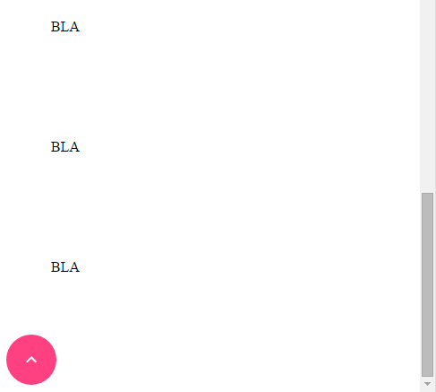

grass-paper-fab-scroll-to-top
================

Functions as a FAB with icon arrow.

Demo:
http://maxgrass.github.io/grass-paper-fab-scroll-to-top/components/grass-paper-fab-scroll-to-top/

Install Bower:
`bower i --save grass-paper-fab-scroll-to-top`

Example 1 - use as a normal page element - not bound to a specific container (uses "window") or pinned on the page:

`<grass-paper-fab-scroll-to-top></grass-paper-fab-scroll-to-top>`

Example 2 - use the button to scroll to top a specific div (default is the window):
add attribute `for-element="short-with-long-content"`

`<grass-paper-fab-scroll-to-top for-element="short-with-long-content"></grass-paper-fab-scroll-to-top>`

document.querySelector('grass-paper-fab-scroll-to-top').forElement

Example 3 - pin the button at bottom right of the page:
add `pin-bottom-right` attribute with no value

`<grass-paper-fab-scroll-to-top pin-bottom-right></grass-paper-fab-scroll-to-top>`

document.querySelector('grass-paper-fab-scroll-to-top').pinBottomRight

Example 4 - Always Show, e.g. on the bottom of the page, when user scrolls to the bottom of the page/container
add `always-show` attribute with no value

`<grass-paper-fab-scroll-to-top always-show></grass-paper-fab-scroll-to-top>`

document.querySelector('grass-paper-fab-scroll-to-top').alwaysShow
